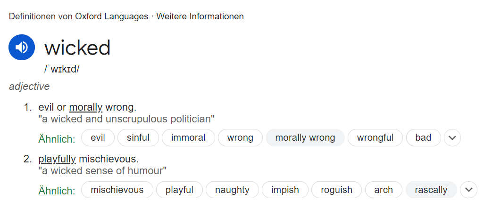

Hello There,

**Wiked** (Wikipedia Edits) is a tool to analyze anonymous Wikipedia contributions made on an ip address within a specified ip range.

It works for any entered IPv4 range within a CIDR limit of /16.
For example, 140.78.0.0/16 works but 140.78.0.0/15 doesn't.
This is a limitation of Wikipedia's API.

This tool is primarily made for the Johannes Kepler University's campus network and its IPv4 range is predefined, which can be chosen during the tool's startup. 
The JKU IPv4 range is from: https://myip.ms/view/web_hosting/348431/University_Linz.html.
Each device connected to the JKU's eduroam internet provider system receives one of these ip addresses. (tested)

Two extra features exist when JKU is selected: 
1. The generated world cloud is masked with the JKU logo.
2. The command 'profs' exists, which searches for contributions made on articles of computer science professors. The professor name list is web-scraped from http://informatik.jku.at/research/faculty.phtml once and then cached.

# Usage

Made with Python 3.10

```
cd .\wiked\
python -m pip install -r requirements.txt
python .\wiked.py
```

The startup sequence will ask for an ip range and if cached contributions should be used. When starting for the first time, the contributions will always be loaded from the web. After that, a *command loop* will start where you can enter different commands to analyze the loaded contributions.

### A generated JKU campus network Wikipedia contributions world cloud


# ~~Wiked~~ Wicked

